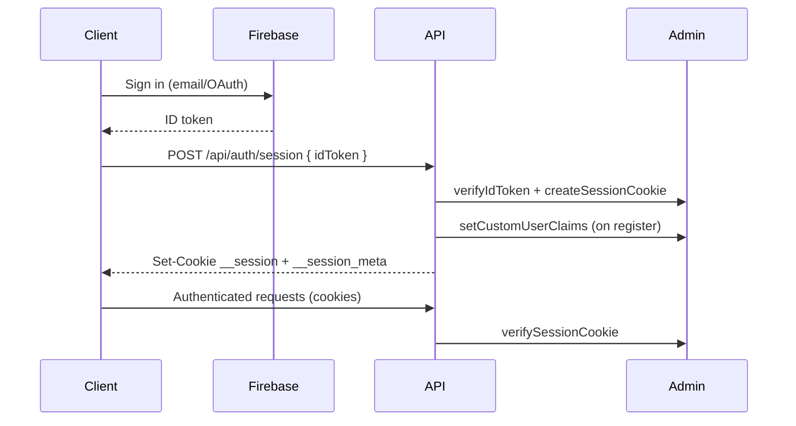

# Authentication & Role-Based Access Control

Success OS implements production-grade authentication with Firebase Auth, secure session management, and a scalable RBAC system supporting 15 distinct roles.

## Authentication methods

| Method | Status | Implementation |
|--------|--------|----------------|
| Email & Password | Active | `signUpWithEmail`, `signInWithEmail` |
| Google Sign-In | Active | `signInWithGoogle` via Firebase OAuth |
| Apple Sign-In | Architecture ready | Enable with `NEXT_PUBLIC_APPLE_SIGNIN_ENABLED=true` |
| Password reset | Active | Firebase `sendPasswordResetEmail` |
| Email verification | Active | Firebase `sendEmailVerification` + banner UI |

## Session architecture



### Security properties

- **HttpOnly cookies** — tokens never stored in `localStorage`
- **HMAC-signed session meta** — middleware reads role without Admin SDK on Edge
- **Firebase Admin verification** — authoritative checks in server layouts and API routes
- **Refresh token revocation** — on logout via `revokeRefreshTokens`
- **Rate limiting** — on registration endpoint
- **Custom claims** — role and permissions embedded in Firebase tokens

## Roles

| Role | Dashboard | Self-registerable |
|------|-----------|-------------------|
| Super Admin | `/dashboard/super-admin` | No |
| Owner | `/dashboard/owner` | No |
| Admin | `/dashboard/admin` | No |
| Academic Director | `/dashboard/academic-director` | No |
| Teacher | `/dashboard/teacher` | No |
| Student | `/dashboard/student` | Yes |
| Parent | `/dashboard/parent` | Yes |
| School | `/dashboard/school` | Yes |
| University | `/dashboard/university` | Yes |
| Educational Center | `/dashboard/educational-center` | Yes |
| Employer | `/dashboard/employer` | Yes |
| Job Seeker | `/dashboard/job-seeker` | Yes |
| Content Creator | `/dashboard/content-creator` | Yes |
| Social Media Manager | `/dashboard/social-media-manager` | No |
| Customer Support | `/dashboard/customer-support` | No |

Elevated roles (Super Admin, Owner, Admin) can access any role dashboard. Other roles are restricted to their own dashboard.

## Permission system

Permissions follow a `resource:action` pattern (e.g. `users:read`, `courses:create`).

- Defined in `types/permissions.ts`
- Mapped to roles in `ROLE_PERMISSIONS`
- Cached in Firebase custom claims for fast checks
- Enforced server-side via `PermissionService`

### Server-side enforcement

```typescript
import { permissionService } from "@/services/auth/permission.service";
import { PERMISSIONS } from "@/types/permissions";

const user = await permissionService.enforcePermission(PERMISSIONS.USERS_WRITE);
```

### Client-side checks

```typescript
import { usePermissions } from "@/hooks/use-permissions";

const { hasPermission } = usePermissions();
if (hasPermission("content:create")) { /* render UI */ }
```

## API routes

| Route | Method | Description |
|-------|--------|-------------|
| `/api/auth/session` | POST | Create session from ID token |
| `/api/auth/session` | GET | Get current authenticated user |
| `/api/auth/logout` | POST | Revoke session and clear cookies |
| `/api/auth/register` | POST | Create user profile + set role claims |
| `/api/auth/role` | GET | Get current role and permissions |
| `/api/auth/role` | POST | Assign role (admin only) |

## Middleware

The middleware engine (`lib/auth/middleware-engine.ts`) evaluates declarative route rules from `lib/auth/middleware-config.ts`:

- Authentication gating (cookie presence)
- Role-based dashboard access (via signed `__session_meta` cookie)
- Account status checks (suspended, pending)
- Auth route redirects for authenticated users

Add new protected routes by extending `MIDDLEWARE_ROUTE_RULES`.

## Apple Sign-In setup

See `lib/auth/providers/apple.ts` for the full checklist. Enable when ready:

```env
NEXT_PUBLIC_APPLE_SIGNIN_ENABLED=true
```

## Environment variables

```env
FEATURE_AUTH_ENABLED=true
AUTH_SESSION_META_SECRET=<random-32+-char-secret>
AUTH_SECURE_COOKIES=true          # production
NEXT_PUBLIC_APPLE_SIGNIN_ENABLED=false
```

## Role assignment

Self-service roles are selected during registration. Elevated roles are assigned by admins via:

```bash
POST /api/auth/role
{ "targetUid": "...", "role": "teacher" }
```

Requires `roles:assign` permission. All assignments are logged in Firestore `role_audit_log`.
