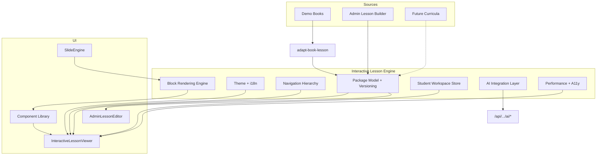

# Interactive Lesson Engine — Master Foundation

Curriculum-agnostic learning engine for Success OS. Schema: `success-os.interactive-lesson-engine.v1`.

**This PR ships the reusable engine only** — no curriculum import, no AI lesson/video generation, no quizzes, no country-specific logic.

## Principles

- Do not redesign existing portals, auth, or business logic
- Reusable across country / curriculum / subject / language
- Lessons are interactive blocks — not a static PDF or single video
- Books-first bridge today; national curricula plug in later via the same package model
- **ADR-0049:** ILE is the **only** lesson runtime — see [`adr/ADR-0049-interactive-lesson-engine-single-runtime.md`](./adr/ADR-0049-interactive-lesson-engine-single-runtime.md)

## Architecture



## Folder structure

```
types/interactive-lesson-engine.ts          # Schema + block types
lib/interactive-lesson-engine/
  index.ts                                  # Public API / engineStatus
  block-library.ts                          # createBlock / meta
  adapt-book-lesson.ts                      # Books-first adapter only
  workspace-store.ts                        # Notes / progress (local)
  future-placeholders.ts                    # Capability stubs
  core/
    theme.ts                                # Theme tokens + CSS vars
    i18n.ts                                 # en/ar engine strings
    versioning.ts                           # bump / publish / history
    hierarchy.ts                            # outlines / breadcrumbs / search
    performance.ts                          # lazy / virtualize / a11y
  ai/
    integration-layer.ts                    # AI contracts (generation OFF)
  adapters/                                 # KaTeX, Mermaid, TipTap, R3F, PDF.js
components/interactive-lesson-engine/
  interactive-lesson-viewer.tsx
  block-renderer.tsx
  slide-engine.tsx
  lesson-navigation.tsx
  student-workspace-panel.tsx
  admin-lesson-editor.tsx
  library/index.tsx                         # Formula/Table/Timeline/...
app/api/interactive-lesson-engine/
  route.js
  ai/[capability]/route.ts                 # Placeholder AI APIs
docs/cursor/interactive-lesson-engine.md
```

## Component hierarchy

```
InteractiveLessonViewer
├── LessonNavigation (breadcrumbs, modes, prev/next, search, outlines)
├── main#ile-lesson-content
│   ├── BlockRenderer → library/* + adapters/*
│   └── SlideEngine → BlockRenderer (virtualized when large)
└── StudentWorkspacePanel (notes, highlights, bookmarks, drawing, AI ask stub)
AdminLessonEditor
├── Structure shells (book / unit / lesson)
├── Blocks (add / reorder DnD / remove)
├── Slides
├── Version history
└── Preview → InteractiveLessonViewer
```

## Data flow

1. **Resolve** — `resolveLessonPackage({ bookId, unitId, lessonId })` or demo package
2. **Adapt** — book lessons → `InteractiveLessonPackage` (sections + slides)
3. **Render** — viewer applies theme CSS vars, filters sections, renders blocks
4. **Persist** — workspace store writes notes/progress to `localStorage`
5. **Admin** — editor mutates draft via `bumpPackageVersion` / `setPublishState`
6. **AI** — `POST /api/interactive-lesson-engine/ai/[capability]` always returns `generationEnabled: false`

## APIs

| Endpoint | Purpose |
|----------|---------|
| `GET /api/interactive-lesson-engine` | status / blocks / catalog / lesson |
| `GET /api/interactive-lesson-engine/ai/catalog` | AI capability contracts |
| `GET/POST /api/interactive-lesson-engine/ai/[capability]` | Placeholder invoke (no generation) |
| `GET /api/interactive-lesson-engine/placeholders/[capability]` | Future capability stubs |

## Routes

| Route | Purpose |
|-------|---------|
| `/student/interactive-lessons` | Engine demo viewer |
| `/student/books/.../lessons/[id]` | **Default** = ILE. `?classic=1` = legacy reader |
| `/admin/interactive-lessons` | Admin builder |
| `/api/interactive-lesson-engine` | Engine API |

## Extension points

- **New block type** — add to `ContentBlockType`, `BLOCK_LIBRARY_META`, `createBlock`, `BlockRenderer`, optional library component
- **New theme** — register in `ILE_THEMES` + CSS vars
- **New locale** — extend `IleLocale` + `ENGINE_STRINGS`
- **New AI capability** — add to `AI_INTEGRATION_LAYER` (keep `generationEnabled: false` until a dedicated PR)
- **Curriculum source** — implement a new adapter that outputs `InteractiveLessonPackage` (do not fork the viewer)

## Future integration points (out of scope here)

- Jordan / national curriculum import
- AI teacher / tutor / video / diagram generation
- Assessment / quiz engine
- Marketplace lesson packs
- Offline sync service workers

## Phases delivered

1. Core architecture (model, blocks, versioning, theme, i18n)
2. Navigation (Book → Unit → Lesson → Slide, outlines, search, progress)
3. Interactive slide / block engine
4. Student workspace
5. AI integration layer (placeholders only)
6. Admin lesson builder
7. Component library
8. Performance + accessibility hooks
9. Contract tests (`npm run validate:interactive-lesson-engine`)
10. This documentation

## Validate

```bash
npm run validate:interactive-lesson-engine
```

## What comes next

See the official sequence in [`learning-platform-roadmap.md`](./learning-platform-roadmap.md):

`#49 ILE ✓ → #50 Curriculum Import (Jordan) → #51 Digital Books → #52–53 AI & Media → #54–55 Assessment & Labs → #56–59 Learning Intelligence → #60 Production`

Next executable PR after this foundation: **#50 Curriculum Import Engine (Jordan First)** — feeds ILE packages; does not fork a second lesson runtime.
