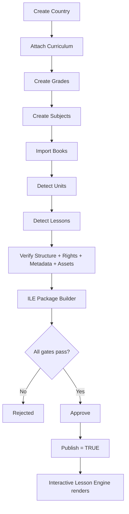

# Jordan Curriculum Reference Implementation (PR #50.1)

Jordan is the first supported country and the **reference example** for every future connector.

**Generic rule:** SA / EG / USA / AP / IGCSE / IB / A Level / EST / ACT = new connector only. **No ILE runtime changes.**

## Pipeline diagram



## Database schema

`success-os.curriculum-hierarchy.v1`

| Entity | Key fields |
|--------|------------|
| Country | id, code, name |
| Curriculum | id, countryId, academicYear, kind |
| Grade | id, curriculumId, code, order |
| Semester | id, gradeId, code, order |
| Subject | id, gradeId, semesterId?, code |
| Book | id, subjectId, part, version, rights, verification, checksum |
| Unit | id, bookId, order, title |
| Lesson | id, unitId, objectives, standards, keywords, assets, activities, published, ilePackageId |
| ILE Package | `success-os.interactive-lesson-engine.v1` |

## Folder structure

```
types/curriculum-hierarchy.ts
types/curriculum-import-engine.ts
content/demo/jordan-grade1-math-reference.ts
content/demo/generated/jordan-g1-math-ile-package.example.json
lib/curriculum-import-engine/
  hierarchy/registry.ts
  reference/jordan-g1-math.ts
  connectors/jordan-g1-math.ts
  ile-package-builder.ts
  verification/engine.ts
  …
components/curriculum-import-engine/import-dashboard.tsx
app/admin/curriculum-import/page.tsx
app/api/curriculum-import-engine/route.ts
docs/cursor/jordan-curriculum-reference.md
docs/cursor/adr/ADR-0050.1-jordan-curriculum-reference.md
```

## Sample Jordan import

```
Jordan → National Curriculum → Grade 1 → Mathematics → Part 1
  → Unit 1 — Numbers around us
    → Lesson 1 — Count to three
      → Objectives / Keywords / References / Assets / Activities / Metadata
      → ILE Package (ile_jo_g1_math_u1_l1)
```

Connector: `jordan-g1-math`  
API: `POST /api/curriculum-import-engine` `{ "action": "run-jordan-g1-math" }`  
Admin: `/admin/curriculum-import` → **Run Jordan G1 Math Reference**

## Generated ILE package example

See [`content/demo/generated/jordan-g1-math-ile-package.example.json`](../../content/demo/generated/jordan-g1-math-ile-package.example.json).

## Verification → Published

Source · Rights · Metadata · Structure · Assets · Package → only then `Published = TRUE`.

## No AI

No AI explanations, videos, summaries, quizzes, or teachers in this PR.

## Validate

```bash
npm run validate:curriculum-import-engine
npm run validate:jordan-curriculum-reference
```
